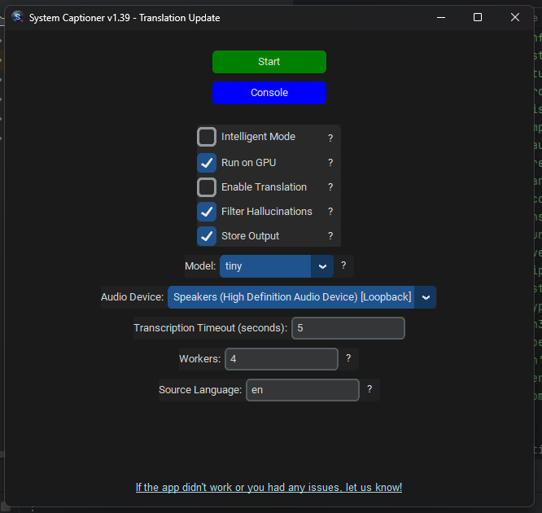

# System Captioner

This application generates and displays real-time captions/subtitles by capturing audio output from a Windows PC. It enhances accessibility for individuals who are deaf or hard of hearing, facilitates language learning, and offers other potential applications. For example, with translation turned on, it enables near real-time communication during foreign language voice calls and provides on-the-fly subtitling for foreign language media, such as anime, without the need for pre-processing video files, and is not limited to any one software boundary.

https://github.com/user-attachments/assets/7315ab7c-fe30-4c37-91aa-60bb32979338

## How it works

1. Captures system audio in real-time through Windows audio loopback using PyAudioWPatch
2. Locally transcribes or translates the recordings using faster-whisper
3. Displays the transcriptions/translations as captions in an overlay window that remains always on top

Language auto-detection, user-friendly GUI, draggable captions box, and intelligent mode that shows captions only when speech is detected.

By default, the app runs on and requires **NVIDIA CUDA** (dependencies included). The app should work with RTX 2000, 3000 and 4000 series cards. Turning off GPU mode will make the app run on CPU; start with the smallest model and settle with the model that's stable. 

## Installation (Windows)

1. Download the latest standalone .zip (currently 1.38) from the releases section and extract all files. 
 
2. Run SystemCaptioner.exe and follow the instructions.

Alternatively build the standalone executable yourself using `build_portable.py`. You will need the nvidia_dependencies folder from the standalone .zip (/SystemCaptioner/Controller/_internal/nvidia_dependencies) and install all the dependencies using requirements.txt inside a venv first. After building, extra nvidia_dependencies folder is generated inside dist/SystemCaptioner/. Delete it. 

## Limitations/Troubleshooting 

‼️ Occasionally, the app can take a long time to start load a model. If there are no clear errors in console, wait for at least a few minutes or try stopping and starting model again. 

⚠️ If you are getting `Library cublas64_12.dll is not found or cannot be loaded` error on console with no translation, copy `cublasLt64_11.dll` and rename to `cublasLt64_12.dll` in `\Controller\_internal\nvidia_dependencies` folder.

If you experienced any issues with System Captioner, let us know in the 'Issues' page of this repo! Include the Console window log if possible. 
